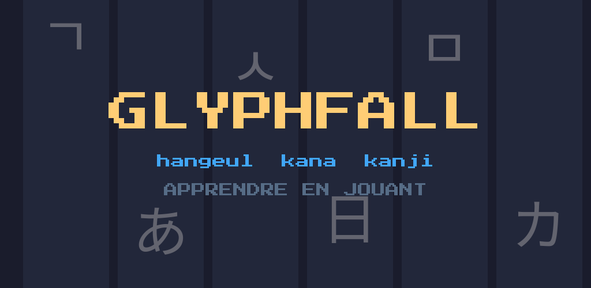
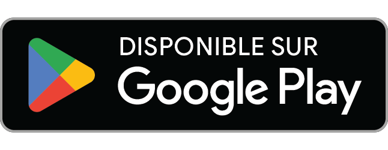
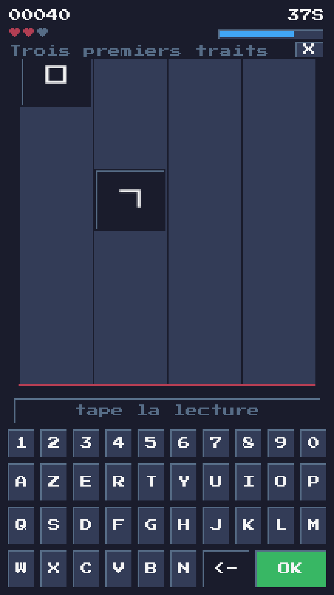
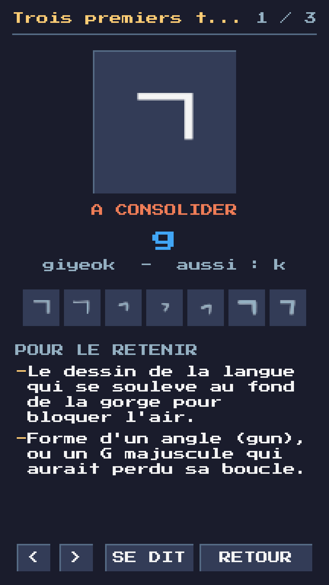
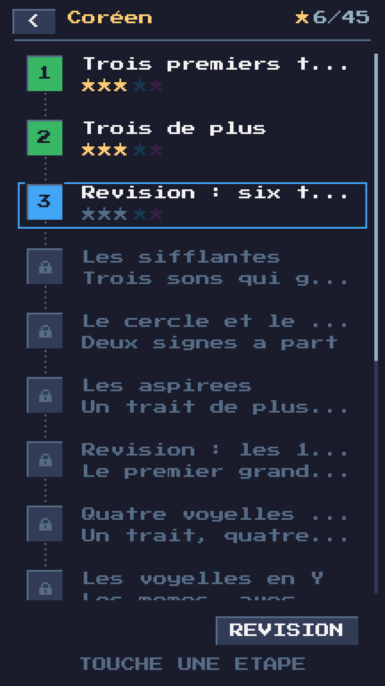

<p align="center">
  
</p>

<p align="center">
  <a href="https://github.com/Game-K-Hack/glyphfall/releases/latest"></a>
  <a href="LICENSE"></a>
  
</p>

# Glyphfall

Les signes tombent. Vous tapez leur lecture avant qu'ils touchent le sol. Au
bout de quelques parties, vous lisez le hangeul — personne ne vous a demandé de
réviser.

Un jeu d'arcade en 8-bit qui enseigne les écritures coréenne et japonaise :
hangeul, hiragana, katakana et premiers kanji. Écrit en Rust avec
[macroquad](https://macroquad.rs), donc le même code tourne sur cinq
plateformes.

## Jouer

**[Jouer tout de suite dans le navigateur →](https://game-k-hack.github.io/glyphfall/)**
Rien à installer, rien à créer.

Ou installer, toujours dans la dernière version publiée :

| | |
|---|---|
| **Windows** | [programme d'installation](https://github.com/Game-K-Hack/glyphfall/releases/latest/download/glyphfall-windows-x86_64-setup.exe) · [exécutable seul](https://github.com/Game-K-Hack/glyphfall/releases/latest/download/glyphfall.exe) |
| **macOS** | [Apple Silicon](https://github.com/Game-K-Hack/glyphfall/releases/latest/download/glyphfall-macos-arm64.tar.gz) · [Intel](https://github.com/Game-K-Hack/glyphfall/releases/latest/download/glyphfall-macos-x86_64.tar.gz) |
| **Linux** | [`.deb` et archives](https://github.com/Game-K-Hack/glyphfall/releases/latest) — Debian, Ubuntu, ou n'importe quelle distribution |
| **Android** | <a href="https://play.google.com/store/apps/details?id=fr.harlock.glyphfall"></a> · [fichier APK](https://github.com/Game-K-Hack/glyphfall/releases/latest/download/glyphfall.apk) |

## Ce qu'il y a dedans

| | | | |
|:-:|:-:|:-:|:-:|
| **4** | **58** | **208** | **4** |
| parcours | niveaux | signes | modes |

- Le **hangeul** coréen, ses quatorze consonnes et ses dix voyelles, puis les
  syllabes.
- Les **hiragana** et les **katakana**, soixante-et-onze signes chacun.
- Vingt premiers **kanji** : les nombres, les jours de la semaine.
- Chaque signe a sa fiche : le tracé trait par trait, un moyen de le retenir,
  sa prononciation — et la voix d'un locuteur pour le coréen et les kana.
- Quatre modes, du *normal* noté en étoiles à l'*infini*, où la chute accélère
  jusqu'à ce que vous cédiez.

<p align="center">
  
  
  
</p>

## Sans rien demander

Pas de publicité, pas d'achat, pas de compte. Aucune permission demandée sur
Android. Tout fonctionne hors ligne, et votre progression reste chez vous.

## Documentation

| | |
|---|---|
| **[Guide du joueur](docs/JOUER.md)** | Comment jouer, les modes, les commandes, ce que fait chaque écran |
| **[Guide du développeur](docs/DEVELOPPEMENT.md)** | Comment le jeu est bâti, comment le compiler, quoi modifier pour ajouter une langue, une police ou une musique |
| [Conditions d'utilisation](web/cgu.html) · [Confidentialité](web/confidentialite.html) | Les deux pages légales, publiées sur le site |

## Compiler

```sh
cargo run --release
```

C'est tout ce qu'il faut pour lancer le jeu depuis les sources. Les autres
plateformes ont chacune leur recette d'une ligne, décrites dans le
**[guide du développeur](docs/DEVELOPPEMENT.md)**.

## Crédits

- **Polices** : Press Start 2P, Noto Sans KR et JP, Nanum Myeongjo, Nanum Pen
  Script, Nanum Brush Script, Gaegu, Jua, Do Hyeon, Shippori Mincho, Klee One,
  Yuji Syuku, Yusei Magic, Zen Maru Gothic et RocknRoll One — toutes sur
  [Google Fonts](https://fonts.google.com), sous SIL Open Font License,
  réduites aux signes du catalogue. Mentions dans
  [`assets/fonts/LICENCES.md`](assets/fonts/LICENCES.md).
- **Palette** : « Sweetie 16 » de GrafxKid, domaine public.
- **Bruitages** : synthétisés par le jeu lui-même, voir `src/audio.rs`.
- **Musique** : générée par un modèle libre exécuté en local, voir les
  `LISEZ-MOI.md` de `assets/music/`.

## Licence

Glyphfall est sous **GNU General Public License v3.0** — voir
[`LICENSE`](LICENSE).

En clair : vous pouvez l'utiliser, l'étudier, le modifier et le redistribuer
librement. La seule contrepartie est le copyleft — toute version modifiée que
vous distribuez doit l'être sous cette même licence, code source compris, et
garder les mentions d'auteur. Une version fermée dérivée de ce code n'est pas
autorisée.

Rien n'interdit à quiconque de vendre des copies : c'est une liberté que la GPL
protège volontairement. Mais il devra livrer le source avec, sous GPL, et tout
acheteur pourra le repartager gratuitement — ce qui ôte à l'exercice son
intérêt commercial.

Les polices échappent à cette licence et gardent la leur, la SIL Open Font
License 1.1. De même pour
[`patches/quad-snd`](patches/quad-snd/LISEZ-MOI-GLYPHFALL.md), une copie
corrigée de la bibliothèque audio de macroquad, sous MIT ou Apache-2.0.
